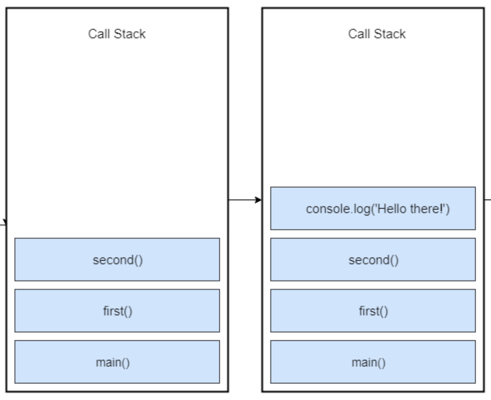

import Code from 'mdx-code';
import { comic } from "mdx-deck/themes";

export const theme = {
  ...comic,
  colors: {
    ...comic.color,
    background: "white",
  },
};

<div
  style={{
    width: "100vw",
    height: "100vh",
    justifyContent: "center",
    display: "flex",
    flexDirection: "column",
    alignItems: "center",
    background: "white",
  }}
>
  
  
</div>

---


# Async Javascript

Event loop, Micro queue, Threads... what?

---


# Javascript

---

# Javascript

### Single threaded

#### The Javascript engine can process one statement at a time

---

# Single threaded

### Don't worry about the concurrency issues

#### Can’t perform long operations such as network access without blocking the main thread

---


# Asynchronous code

- callbacks
- promises
- async/await

---


# But first...

---

## How Does Synchronous Javascript Work?

---

## Example

<Code>

```js
const second = () => {
  console.log('Hello there!');
}

const first = () => {
  console.log('Hi there!');
  second();
  console.log('The End');
}

first();
```

</Code>

---


# Execution context
# Call stack

---

# Execution context

### An abstract concept of an environment where the JavaScript code is evaluated and executed.
### Whenever any code is run in JavaScript, it’s run inside an execution context

---

# Call stack

### A LIFO (Last in, First out) structure, which is used to store all the execution context created during the code execution
### JavaScript has a single call stack because it’s a single threaded programming language

---

## Example

<Code>

```js
const second = () => {
  console.log('Hello there!');
}

const first = () => {
  console.log('Hi there!');
  second();
  console.log('The End');
}

first();
```

</Code>

---


---


<Code>

```js
first();
```

</Code>

---


<Code>

```js
const first = () => {
  console.log('Hi there!');
  second();
  console.log('The End');
}
```

</Code>

---



<Code>

```js
const second = () => {
  console.log('Hello there!');
}
```

</Code>

---


<Code>

```js
const first = () => {
  console.log('Hi there!');
  second();
  console.log('The End');
}
```

</Code>

---


<Code>

```js
const first = () => {
  console.log('Hi there!');
  second();
  console.log('The End');
}
```

</Code>

---


---


# And now...

---

## How Does Asynchronous JavaScript Work?

---

## Example

<Code>

```js
const processImage = (image) => {
  /**
   * doing some operations on image
   **/
  console.log('Image processed');
}

const networkRequest = (url) => {
  /**
   * requesting network resource
   **/
  return 'someData';
}

const greeting = () => {
  console.log('Hello World');
}

processImage('logo.jpg');
networkRequest('www.somerandomurl.com');
greeting();
```

</Code>

---


## So what’s the solution?

---

## Callbacks

<Code>

```js
const networkRequest = () => {
  setTimeout(() => {
      console.log('Async Code');
    }, 2000);
};

console.log('Hello World');
networkRequest();
```

</Code>

---


---


### <sup>*</sup>The event loop, the web APIs and the message queue are not part of the JavaScript engine, it’s a part of browser’s JavaScript runtime environment

---

## Async example

<Code>

```js
const networkRequest = () => {
  setTimeout(() => {
    console.log('Async Code');
  }, 2000);
};

console.log('Hello World');
networkRequest();
console.log('The End');
```

</Code>

---


---


# Event loop
# DOM events

---

# Event loop

### The job of the Event loop is to look into the call stack and determine if the call stack is empty or not
### If the call stack is empty, it looks into the message queue to see if there’s any pending callback waiting to be executed

---

# DOM events

### The event listener sits in the web APIs environment waiting for a certain event to happen, and when that event happens, then the callback function is placed in the message queue

---

## Event listener example

<Code>

```js
document.querySelector('.btn').addEventListener('click',(event) => {
  console.log('Button Clicked');
});
```

</Code>

---


## One more thing...

---


## ES6 Micro-Task queue

---

# Micro-Task queue

### ES6 introduced the concept of micro-task queue which is used by Promises in JavaScript

### The difference is that the micro queue has a higher priority than the message queue

---

## Micro queue example

<Code>

```js
console.log('Script start');

setTimeout(() => {
  console.log('setTimeout');
}, 0);

new Promise((resolve, reject) => {
  resolve('Promise resolved');
})
  .then(res => console.log(res))
  .catch(err => console.log(err));

console.log('Script End');
```

</Code>

---

## Micro queue example

<Code>

```js
console.log('Script start');

setTimeout(() => {
  console.log('setTimeout 1');
}, 0);

setTimeout(() => {
  console.log('setTimeout 2');
}, 0);

new Promise((resolve, reject) => {
  resolve('Promise 1 resolved');
})
  .then(res => console.log(res))
  .catch(err => console.log(err));

new Promise((resolve, reject) => {
  resolve('Promise 2 resolved');
})
  .then(res => console.log(res))
  .catch(err => console.log(err));

console.log('Script End');
```

</Code>

---

## Micro queue example

<Code>

```js
console.log('Script start');

setTimeout(() => {
  console.log('setTimeout');
}, 0);

new Promise((resolve, reject) => {
  resolve('Promise 1 resolved');
})
  .then(res => console.log(res));
    new Promise((resolve, reject) => {
      resolve('Promise 2 resolved');
    })
      .then(res => {
        console.log(res);
        return new Promise((resolve, reject) => {
          resolve('Promise 3 resolved');
        })
})
  .then(res => console.log(res));

console.log('Script End');
```

</Code>

---


### <sup>*</sup>The event loop will first empty the micro queue before executing any callback in the message queue

---

# Conclusions

- How asynchronous Javascript works
- Call stack
- Event loop
- Message queue
- Micro task queue

---


### Thank you for your time!
